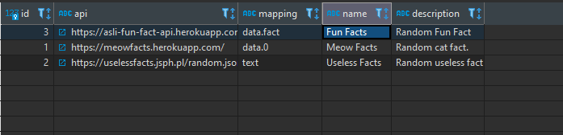

# Full Stack Challenge - Serverless AWS App
https://thoughtfulautomation.notion.site/Full-Stack-Challenge-Serverless-AWS-App-c73f346b134948f1a578845fe4ab8ac0

I started this challenge reviewing the details and requirements, identifying the parts I found interesting. I immediately began with what I knew:
- Frontend via **React**
- **Lambda** behind an **API Gateway** (and **Route 53**)
- Send email via **SES**. I had already verified my `pjfontillas.com` domain with other projects so I'm using that for this challenge.

Then I hit the first stumbling block: Serverless framework for **Infrastructure as Code**. I'll be honest, I already had experience with CI/CD and serverless, but
not specifically using serverless.com as the delivery method. I thought about what I already knew how to do and searched for parallels in serverless.com. [skip to parallels](#mardown-header-but)

And then I found this: [serverless-react-boilerplate](https://github.com/arabold/serverless-react-boilerplate).
Reading through its entirety I realized it was a good starting point and that I could expand upon it.

## Tasks that I identified as being part of the challenge
- [X] Custom domain applied to app
- [X] Secrets Manager needed to store credentials for Lambda DB access (only manual step/outside of CI/CD)
- [X] Create user flow to enter email and generate verification token
  - if no token saved in browser prompt user to enter email. Token is used as sort of automatic auth process.
  - Lambda saves token and email to DB
  - Lambda sends email with link to verify email address using token
  - User clicks on verification link in email
  - Lambda updates user record as having been verified
  - User is now allowed to view workers for different APIs
- [X] Handler support for listing workers; user needs to be verified to view
- [X] React app to display workers

## Tables needed for this app
### User
  - id serial
  - email varchar
  - token varchar
  - verified boolean

### Worker
  - id serial
  - api varchar
  - mapping varchar
  - name varchar
  - description varchar

## Files modified
  - serverless.yml
  - handler.ts
  - src/
    - App.tsx
    - App.css
    - components/
      - Workers.tsx
      - Worker.tsx
  - public/
    - manifest.json
    - favicon.ico
  - webpack.server.config.js
  - no-pg-native.js

## Why?
You might now be asking: **why** did I use this boilerplate? Well that's a pretty straightforward answer. I was given _five_ (5) hours to do this. That's it. That's all the reason I needed.

There are times to be a pioneer and MacGyver your way to a solution. Then there are times to go to the store and find a tool that already suits your needs.

Given the time constraint, I believed the latter to be the most efficient solution. Engineers use references, templates, and boilerplates on a daily basis, and I believe my ability to understand and execute the ideas put forth to be the primary goal of this challenge.

## But...

That said, I'm going to propose possible alternatives that can be used in situations where the use of serverless.com might not be possible or it is unable to meet our needs.

Before I had even seen the requirement for using **serverless.com** I had already started thinking about alternatives to hosting the site via **S3**.

**AWS Amplify** is another tool that allows for deployments from hooks into platforms like **GitHub**, primarily via making use of branches. Useful for QA, pre-release, and multi-version production environments.

**Lambda** deployment is also possible via **AWS Serverless Application Model (SAM) CLI**, which also handles **API Gateway** and **Route 53** configuration (among other services like **RDS** and **ElastiCache**) via **YAML** configuration. This functionality is replicated via **serverless.com**.

The overarching theme of this thought process was keeping as much of the SDLC in one platform (being **AWS**), with **GitHub** being the primary outlier. Not including **Jira** and **Confluence** but those are primarily for documentation and administration purposes.

I know I can architect this solution because I have done it before. However, the challenge called for **serverless.com**. These alternatives are candidates for design discussion for future iterations or projects that have the capacity to spend time building our own boilerplate customized to our needs. Even more alternative challenges include putting more focus on localized workflows to make better use of test-driven development. With more time I would have liked to de-couple more of the business logic from the API, splitting out the handler into API and DB related tasks. On the front-end this boilerplate is lacking SASS or similar support so that is another avenue of possible improvement.

I hope you enjoyed my analysis and execution of this challenge and I look forward to our code review.

_Patrick Fontillas_